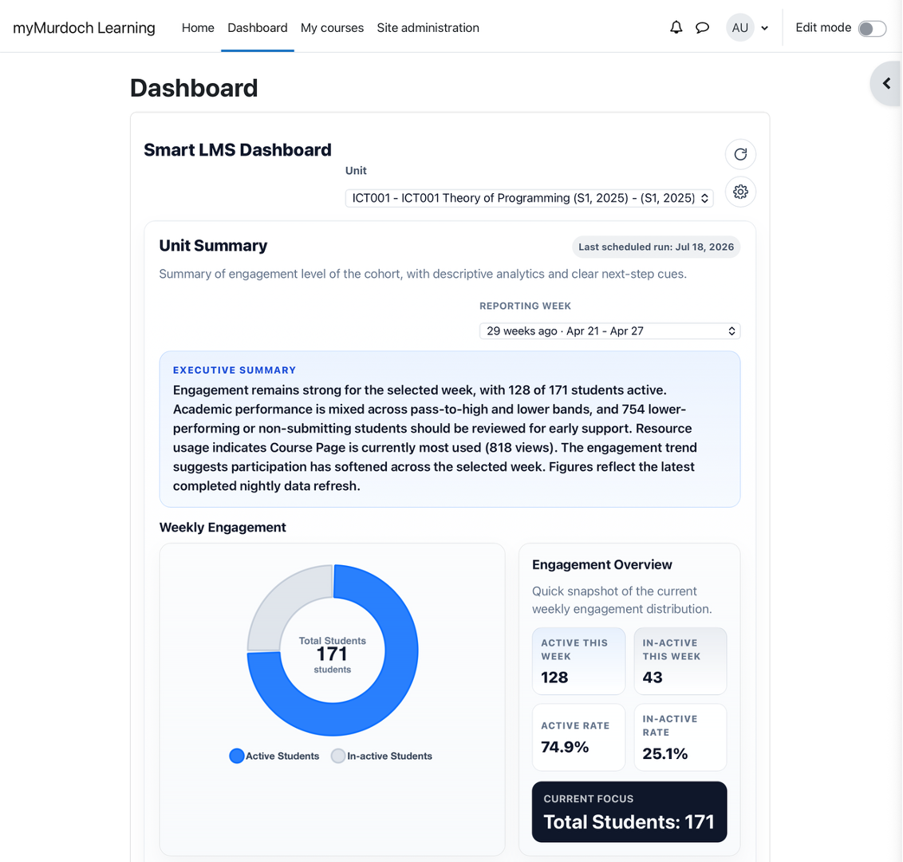
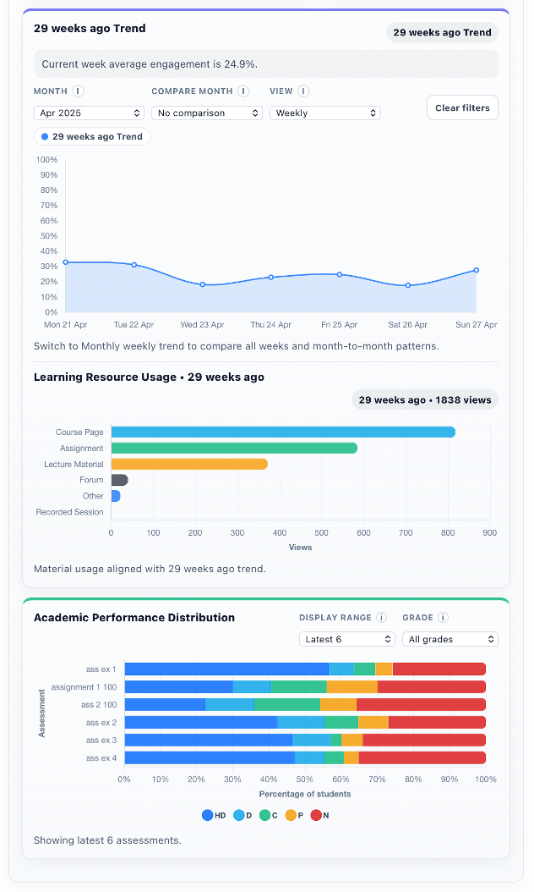
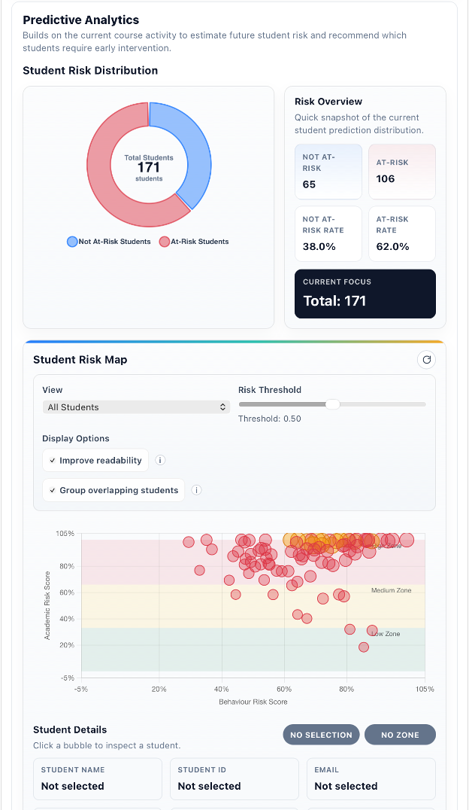
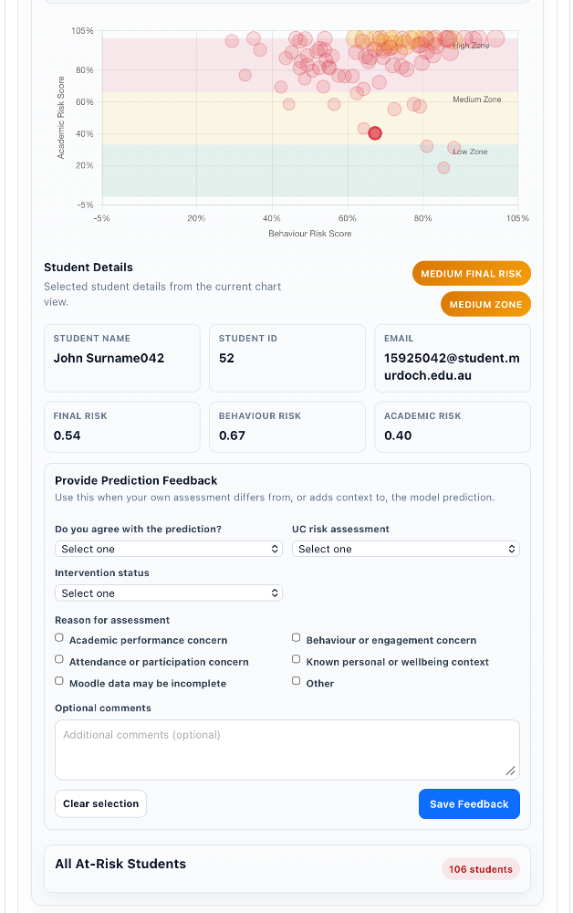
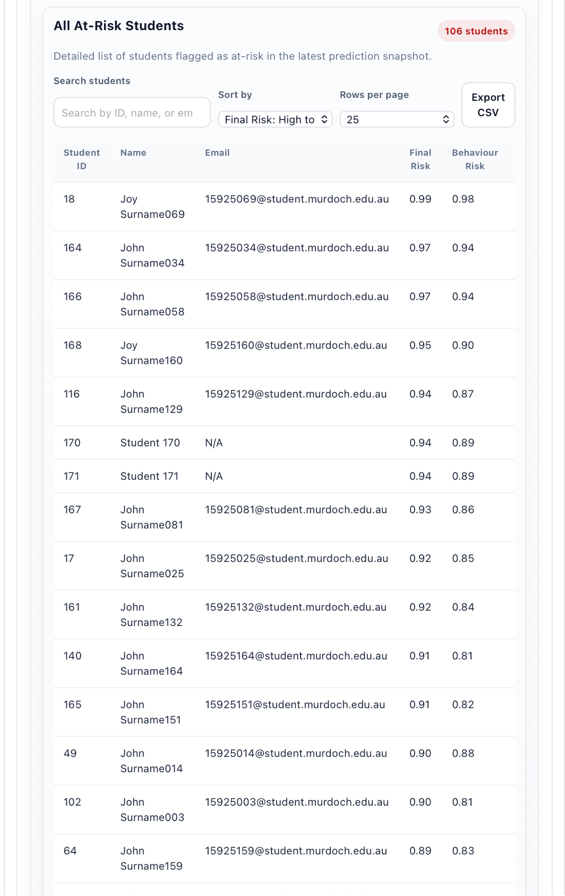
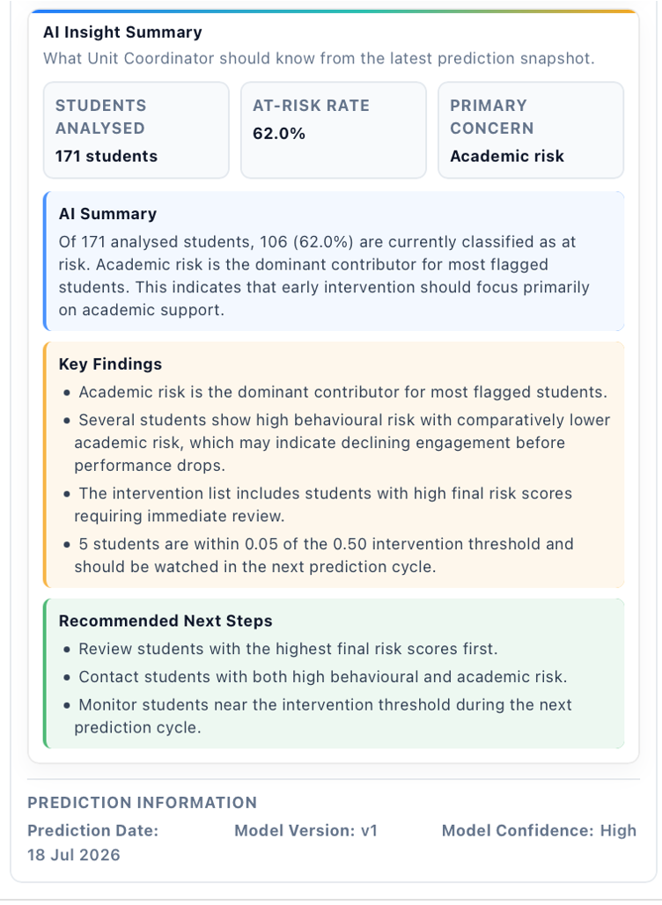
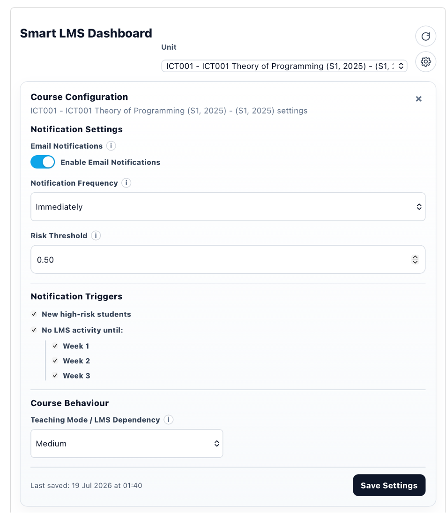
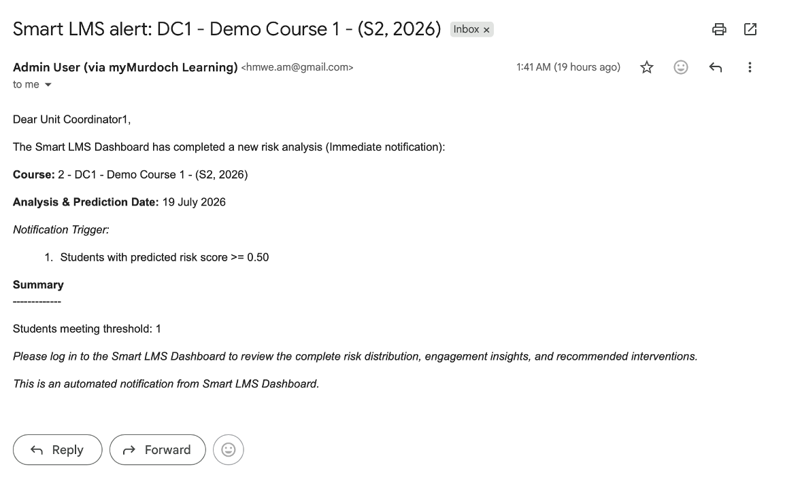

# Smart LMS Dashboard for Moodle

A learning analytics system that combines a Moodle dashboard plugin with a Python ETL and machine learning pipeline.

## Overview

The Smart LMS Dashboard was developed to help unit coordinators  monitor student engagement, academic performance, course activity, and potential learning risks within Moodle. It also sends automated email notifications when updated risk results identify students who may require review or early intervention.

A scheduled daily pipeline extracts data from Moodle, transforms it into an analytics-ready structure, generates machine-learning predictions, and stores the results for display within the Moodle dashboard. Pipeline logs allow Moodle administrators to review execution status and investigate processing issues.

This project was originally developed and tested in a university-hosted Moodle environment. Access to the original virtual machine and Moodle database ended when the university project was completed.

## Main Features

- Dashboard integration within Moodle
- Student engagement and academic-performance analytics
- Daily automated ETL and prediction pipeline
- Extraction and transformation of Moodle activity and assessment data
- Academic and behavioural risk-prediction models
- Student-risk distribution and intervention-priority views
- Model evaluation and monitoring
- Prediction storage for Moodle dashboard integration
- Scheduled background processing using Linux cron
- Automated risk-update email notifications for assigned unit coordinators
- Course-level notification and risk-threshold configuration
- Configurable inactivity triggers and notification frequency
- Prediction-feedback and intervention-status recording
- Pipeline execution logs for Moodle administrators
- Docker configuration for a consistent and reproducible runtime environment


## System Architecture 

```text
Linux Cron Scheduler
        |
        v
Daily Moodle Data Extraction
        |
        v
ETL and Data Validation
        |
        v
Analytics Database
        |
        v
Feature Engineering and Prediction
        |
        v
Prediction and Monitoring Results
        |
        +----------------------+
        |                      |
        v                      v
Moodle Dashboard      Email Notifications
                              |
                              v
                    Assigned Unit Coordinators
```

## Technologies

- Python
- PHP
- JavaScript
- SQL
- Moodle
- Docker
- Linux
- Cron
- Jupyter Notebook

## Project Status 
The original university VM and Moodle database are no longer accessible, so local execution requires a separate Moodle environment. 

## Dashboard Preview

The following screenshots demonstrate the dashboard using synthetic or sanitized data.

### Dashboard Overview

The unit summary provides an executive overview of student engagement, active and inactive student counts, and the latest scheduled analytics refresh.




### Predictive Analytics

The predictive analytics view summarizes the current student-risk distribution and compares behavioural and academic risk scores. An adjustable threshold supports the identification of students who may require early intervention.





### AI-Assisted Insight Summary

The insight summary translates prediction results into key findings and recommended next steps, helping unit coordinators prioritize student-support actions.



### Course Configuration

Authorized users can configure email notifications, notification frequency, prediction thresholds, inactivity triggers, and the expected level of LMS participation for each course.



### Automated Risk Notification

When configured risk conditions are met, the system sends an automated email notifying the unit coordinator that a new analysis is ready for review.




